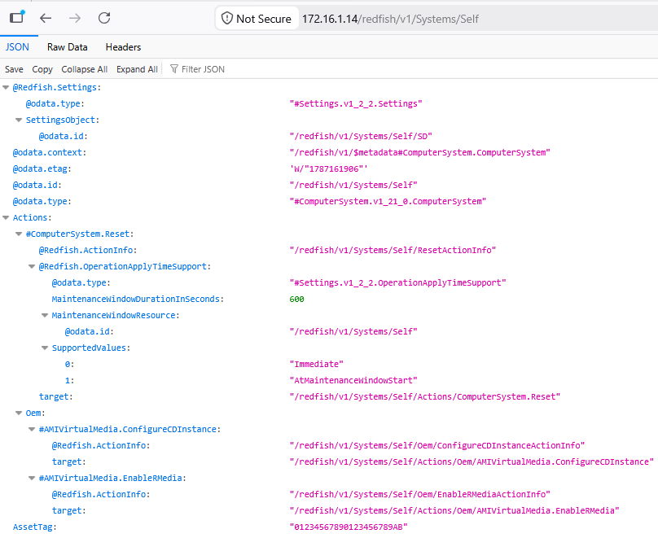
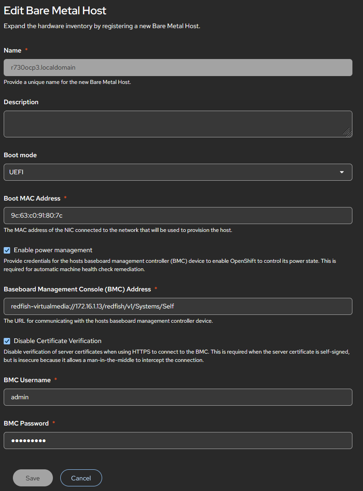

Ref: https://github.com/openshift/installer/blob/main/docs/user/metal/install_ipi.md  
Ref: https://access.redhat.com/solutions/7135358  
$${\color{deeppink}\textbf{\textsf{Note:}}}$$ This might differ slightly by server manufacturer even though it's supposed to be a consistent spec for OEMs...  
  
To test redfish endpoint: https://172.16.1.14/redfish/v1/Systems/Self  
  

  
```text
redfish-virtualmedia://172.16.1.13/redfish/v1/Systems/Self
```
  

