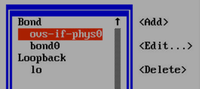
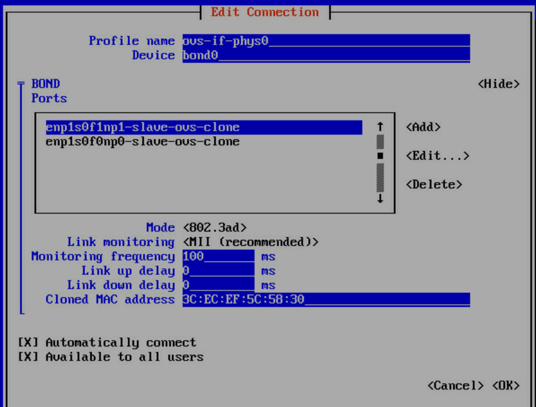
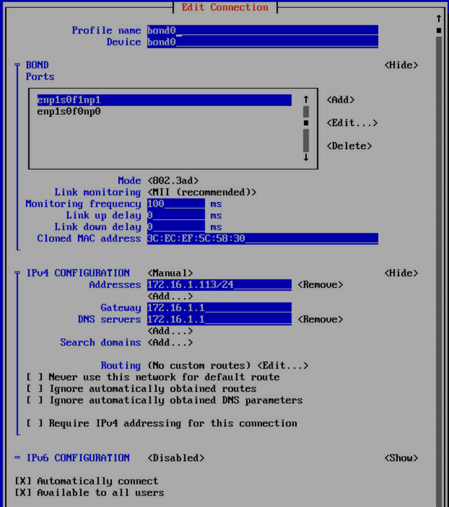
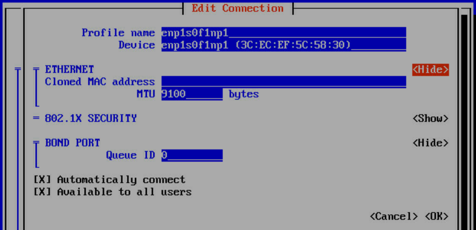
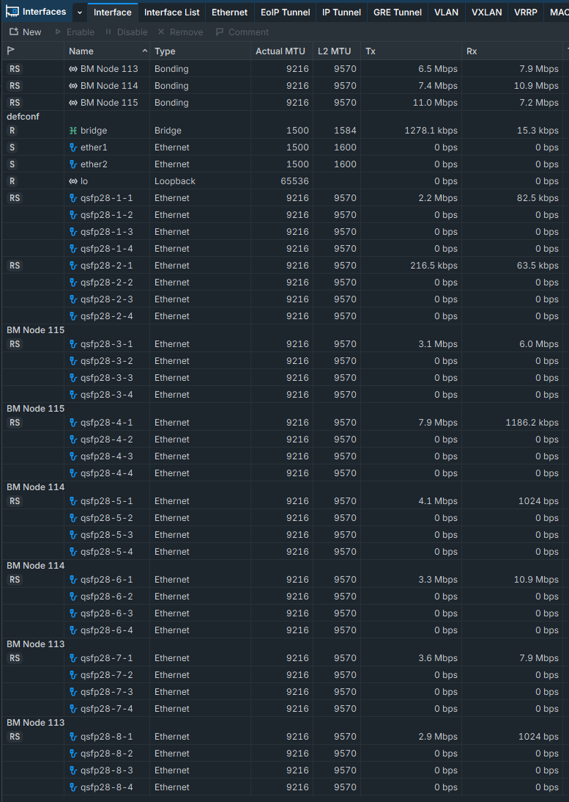

$${\color{deeppink}\textbf{\textsf{Note:}}}$$ Initial network configurations exist at `/etc/NetworkManager/system-connections/` on the nodes. If you ever get in a pickle and you have configured the nodes with a `core` login, you can login and use `nmtui` to fix the nodes.
	
How a cluster with bonded NICs looks from `nmtui` in a RHEL CoreOS node:  





  
$${\color{deeppink}\textbf{\textsf{Note:}}}$$ NMState Operator Required


To account for the 100-byte OVN Geneve encapsulation overhead while establishing a true 9000 MTU cluster pod network, your underlying hardware interfaces must be capable of supporting 9100 MTU. Because this is a bare-metal architecture using an LACP bond (bond0), the target hardware configuration changes to 9100. This modification guarantees that 9000 bytes (Pod Payload) + 100 bytes (Geneve Headers) = 9100 bytes travels cleanly over the physical switches without packet fragmentation.  

$${\color{yellow}\textbf{\textsf{CRITICAL:}}}$$ Before performing these steps, verify that your physical Top-of-Rack (ToR) switches are configured to allow jumbo frames of at least 9100 bytes!
- Many network engineers set switches to `9216` or `9198` to handle LACP/VLAN stacking headers natively.  


### Phase 1: Shift Bare-Metal Host Bond to MTU 9100  
Update your NodeNetworkConfigurationPolicy (NNCP) to apply an MTU of 9100 across both physical slave network interfaces (enp1s0f0np0 and enp1s0f1np1) and the aggregate logical LACP bond (bond0).
Update your NMState file (jumbo-bond-mtu.yaml)  
$${\color{deeppink}\textbf{\textsf{Note:}}}$$ Your interface names may vary...  
  
If the cluster was built with only one interface and now you want to add another interface and form a bond (This might require changes for your exact setup):  
[Source: `Sources/set-lacp-bond-jumbo-frames.yaml`](Sources/set-lacp-bond-jumbo-frames.yaml)
<!-- embed-code: ./Sources/set-lacp-bond-jumbo-frames.yaml -->
```yaml
apiVersion: nmstate.io/v1
kind: NodeNetworkConfigurationPolicy
metadata:
  name: set-lacp-bond-jumbo-frames
spec:
  nodeSelector:
    kubernetes.io/os: linux
  desiredState:
    interfaces:
      # 1. First physical interface
      - name: enp1s0f0np0
        type: ethernet
        state: up
        mtu: 9100
      # 2. Second physical interface
      - name: enp1s0f1np1
        type: ethernet
        state: up
        mtu: 9100
      # 3. LACP Aggregate Bond
      - name: bond0
        type: bond
        state: up
        mtu: 9100
        link-aggregation:
          mode: 802.3ad
          port:
            - enp1s0f0np0
            - enp1s0f1np1
```
If you *created* the cluster with a bond already built across two NIC, perhaps during the assisted installer setup...
  
The initial NodeNetworkConfigurationPolicy (NNCP) was broken above when applied to a cluster that was built with two bonded NICs because it attempted to redefine the entire bond parameters (like mode: 802.3ad) inside NMState without referencing the existing configurations. 
- NMState saw this as a command to destroy the existing bond and create a new one from scratch, which failed during reboot because it conflicted with the node's original network configuration.
- When using NMState to update an existing bond, you should only declare the attributes you want to change (the MTU) and let NMState merge them into the existing bond setup. 
- You do not need to redefine the LACP mode or the ports array.  
   
Here is the corrected NNCP that safely modifies the MTU of bond0 and its slave interfaces without breaking the link aggregation:  
[Source: `Sources/set-lacp-bond-jumbo-frames-min.yaml`](Sources/set-lacp-bond-jumbo-frames-min.yaml)
<!-- embed-code: ./Sources/set-lacp-bond-jumbo-frames-min.yaml -->
```yaml
apiVersion: nmstate.io/v1
kind: NodeNetworkConfigurationPolicy
metadata:
  name: set-lacp-bond-jumbo-frames-min
spec:
  nodeSelector:
    kubernetes.io/os: linux
  desiredState:
    interfaces:
      # 1. Update first slave interface MTU only
      - name: enp1s0f0np0
        type: ethernet
        state: up
        mtu: 9100
      # 2. Update second slave interface MTU only
      - name: enp1s0f1np1
        type: ethernet
        state: up
        mtu: 9100
      # 3. Update the existing bond0 MTU only
      - name: bond0
        type: bond
        state: up
        mtu: 9100
```
There are times that you just need to adjust un-used NICs to a higher MTU to clear the ODF Alert as it looks at all NICs on the system:  
[Source: `Sources/set-jumbo-mtu.yaml`](Sources/set-jumbo-mtu.yaml)
<!-- embed-code: ./Sources/set-jumbo-mtu.yaml -->
```yaml
apiVersion: nmstate.io/v1
kind: NodeNetworkConfigurationPolicy
metadata:
  name: set-jumbo-mtu
spec:
  nodeSelector:
    kubernetes.io/os: linux
  desiredState:
    interfaces:
      - mtu: 9100
        name: eno1
        type: ethernet
      - mtu: 9100
        name: usb0
        type: ethernet
      - mtu: 9100
        name: enp193s0f0np0
        type: ethernet
      - mtu: 9100
        name: enp193s0f1np1
        type: ethernet
```
#### Apply the manifest:
```bash
oc apply -f jumbo-bond-mtu.yaml
```
#### Ensure the underlying infrastructure transitions cleanly by tracking the Node Network Configuration Enactment (NNCE):
```bash
oc get nnce
```
$${\color{yellow}\textbf{\textsf{CRITICAL:}}}$$ *Do not proceed until all bare-metal nodes read 'SuccessfullyEnacted'.*
  
#### Validate NIC MTU  
```bash
[root@ocp113 core]# ip link show | grep -i 'state up'
4: enp1s0f0np0: <BROADCAST,MULTICAST,SLAVE,UP,LOWER_UP> mtu 9100 qdisc mq master bond0 state UP mode DEFAULT group default qlen 1000
5: enp1s0f1np1: <BROADCAST,MULTICAST,SLAVE,UP,LOWER_UP> mtu 9100 qdisc mq master bond0 state UP mode DEFAULT group default qlen 1000
12: bond0: <BROADCAST,MULTICAST,MASTER,UP,LOWER_UP> mtu 9100 qdisc noqueue master ovs-system state UP mode DEFAULT group default qlen 1000
```
  
### Phase 2: Migrate OVN-Kubernetes Cluster MTU to 9000  
With a 9100-byte MTU established on the physical NICs, you can now target a 9000 cluster network MTU.  
  
#### Retrieve Current Cluster MTU  
Verify your starting point (typically 1500 or whatever was configured in your initial setup):  
```bash
oc get network.config cluster -o jsonpath='{.status.clusterNetworkMTU}'
```
  
#### Execute the Migration Patch  
$${\color{deeppink}\textbf{\textsf{Note:}}}$$ *If you skip this step you will get a `InvalidOperatorConfig` warning on the network cluster operator!*  
Patch the CNO to begin the MTU transition. Change the target network (to) to 9000. If your current configuration step outputted a value other than 1500, update the from field accordingly:  
```bash
oc patch Network.operator.openshift.io cluster --type=merge --patch '{"spec":{"migration":{"mtu":{"machine":{"from":1500,"to":9100},"network":{"from":1400,"to":9000}}}}}'
```
  
#### Complete the Rolling Reboot Cycle  
The Machine Config Operator (MCO) will safely rewrite network configs and execute a sequential rolling reboot across master and worker pools. Track this progression:
```bash
oc get machineconfigpools
```
Wait for all pools to reach an idle state (UPDATED=True, UPDATING=False, DEGRADED=False)  
  
#### Lock In the 9000 Cluster MTU  
Once the infrastructure rolling reboots have completed cleanly, finalize the transition by wiping out the active migration tracking block and setting your default OVN-Kubernetes spec to 9000:  
```bash
oc patch Network.operator.openshift.io cluster --type=merge --patch '{"spec":{"defaultNetwork":{"ovnKubernetesConfig":{"mtu":9000}},"migration":null}}'
```
  
#### Verify Successful Runtime Execution  
Confirm the cluster runtime recognizes the new parameters:  
```bash
oc get network.config cluster -o jsonpath='{.status.clusterNetworkMTU}'
oc get network.operator.openshift.io cluster -o jsonpath="{.spec.defaultNetwork.ovnKubernetesConfig.mtu}"
```
The console should return a value of 9000.

### Validate it Actually Works  
#### Step 1: Deploy Two Test Pods on Different Nodes  
Save the following manifest as mtu-test-pods.yaml. This uses anti-affinity to force the pods onto completely different physical bare-metal hosts.  
[Source: `Sources/mtu-test-deploy.yaml`](Sources/mtu-test-deploy.yaml)
<!-- embed-code: ./Sources/mtu-test-deploy.yaml -->
```yaml
apiVersion: apps/v1
kind: Deployment
metadata:
  name: mtu-test-deploy
  namespace: default  # <-- Or whatever namespace you want
spec:
  replicas: 2
  selector:
    matchLabels:
      app: mtu-test
  template:
    metadata:
      labels:
        app: mtu-test
    spec:
      affinity:
        podAntiAffinity:
          requiredDuringSchedulingIgnoredDuringExecution:
            - labelSelector:
                matchExpressions:
                  - key: app
                    operator: In
                    values:
                      - mtu-test
              topologyKey: "kubernetes.io/hostname"
      containers:
      - name: alpine
        image: alpine:latest
        command: ["/bin/sh", "-c", "sleep infinity"]
        securityContext:
          capabilities:
            add: ["NET_RAW"]
```
Apply the deployment:
```text
oc apply -f mtu-test-pods.yaml
```
  
#### Step 2: Run the Validation Script  
Once both pods are running, copy and paste this script into a file. It automatically fetches the names of your separate pods, finds the destination pod's internal cluster IP, and fires the precise jumbo packet.

[Source: `Sources/ping_9k_mtu.sh`](Sources/ping_9k_mtu.sh)
<!-- embed-code: ./Sources/ping_9k_mtu.sh -->
```bash
#!/bin/bash

# 1. Wait for pods to be ready
echo "Waiting for test pods to be running..."
oc wait --for=condition=Ready pod -l app=mtu-test --timeout=60s

# 2. Extract Pod Names and IPs
POD_A=$(oc get pods -l app=mtu-test -o jsonpath='{.items[0].metadata.name}')
POD_B=$(oc get pods -l app=mtu-test -o jsonpath='{.items[1].metadata.name}')
POD_B_IP=$(oc get pod $POD_B -o jsonpath='{.status.podIP}')

NODE_A=$(oc get pod $POD_A -o jsonpath='{.spec.nodeName}')
NODE_B=$(oc get pod $POD_B -o jsonpath='{.spec.nodeName}')

echo "=========================================================="
echo "Source Pod:      $POD_A (on Node: $NODE_A)"
echo "Destination IP:  $POD_B_IP ($POD_B on Node: $NODE_B)"
echo "Executing:       ping -s 9000 $POD_B_IP"
echo "Press [Ctrl + C] at any time to stop the test."
echo "=========================================================="
echo ""

# 3. Execute the indefinite 9000 payload ping
oc exec $POD_A -it -- ping -s 9000 $POD_B_IP
```
Run the script from your bastion console:
```text
C:\Users\admin\Desktop\ocp> .\ping_9k_mtu.sh
```
What to expect in the output:  
Because a 9000 payload generates a 9008-byte packet, the source pod will break this down into two fragments to fit into the 9000 MTU cluster limit:
- Fragment 1: 9000 bytes (including headers)
- Fragment 2: 8 bytes (remaining payload)
If your physical host switches and bond0 interfaces are correctly configured to 9100 MTU, these fragments will encapsulate into OVN Geneve cleanly and safely reach the destination pod without getting dropped by the hardware fabric.
```text
Waiting for test pods to be running...
pod/mtu-test-deploy-757f84c8f6-6psnq condition met
pod/mtu-test-deploy-757f84c8f6-tcpp6 condition met
==========================================================
Source Pod:      mtu-test-deploy-757f84c8f6-6psnq (on Node: ocp113.localdomain)
Destination IP:  10.130.0.178 (mtu-test-deploy-757f84c8f6-tcpp6 on Node: ocp114.localdomain)
Executing:       ping -s 9000 10.130.0.178
Press [Ctrl + C] at any time to stop the test.
==========================================================

Unable to use a TTY - input is not a terminal or the right kind of file
PING 10.130.0.178 (10.130.0.178): 9000 data bytes
9008 bytes from 10.130.0.178: seq=0 ttl=62 time=5.049 ms
9008 bytes from 10.130.0.178: seq=1 ttl=62 time=2.965 ms
9008 bytes from 10.130.0.178: seq=2 ttl=62 time=0.640 ms
9008 bytes from 10.130.0.178: seq=3 ttl=62 time=0.530 ms
9008 bytes from 10.130.0.178: seq=4 ttl=62 time=0.555 ms
```
To benchmark speed between two pods on different nodes:  
[Source: `Sources/iperf3-server.yaml`](Sources/iperf3-server.yaml)
<!-- embed-code: ./Sources/iperf3-server.yaml -->
```yaml
apiVersion: apps/v1
kind: Deployment
metadata:
  name: iperf3-server
  namespace: default
spec:
  replicas: 1
  selector:
    matchLabels:
      app: iperf3-server
  template:
    metadata:
      labels:
        app: iperf3-server
    spec:
      containers:
      - name: iperf3
        image: networkstatic/iperf3:latest
        command: ["iperf3", "-s"]
        ports:
        - containerPort: 5201
```
[Source: `Sources/iperf3-client.yaml`](Sources/iperf3-client.yaml)
<!-- embed-code: ./Sources/iperf3-client.yaml -->
```yaml
apiVersion: apps/v1
kind: Deployment
metadata:
  name: iperf3-client
  namespace: default
spec:
  replicas: 1
  selector:
    matchLabels:
      app: iperf3-client
  template:
    metadata:
      labels:
        app: iperf3-client
    spec:
      affinity:
        podAntiAffinity:
          requiredDuringSchedulingIgnoredDuringExecution:
            - labelSelector:
                matchExpressions:
                  - key: app
                    operator: In
                    values:
                      - iperf3-server
              topologyKey: "kubernetes.io/hostname"
      containers:
      - name: iperf3
        image: networkstatic/iperf3:latest
        command: ["/bin/sh", "-c", "apt-get update && apt-get install -y procps && sleep infinity"] # Fixed package manager to apt-get
```
[Source: `Sources/perf_9k_mtu.sh`](Sources/perf_9k_mtu.sh)
<!-- embed-code: ./Sources/perf_9k_mtu.sh -->
```bash
#!/bin/bash

echo "Waiting for iperf3 test pods to spin up in the default namespace..."
oc wait --for=condition=Ready pod -l app=iperf3-server -n default --timeout=60s
oc wait --for=condition=Ready pod -l app=iperf3-client -n default --timeout=60s

# FIXED: Removed jsonpath completely. Uses standard columns to stay immune to Windows shell parsing.
SERVER_POD=$(oc get pods -l app=iperf3-server -n default --no-headers | awk '{print $1}')
CLIENT_POD=$(oc get pods -l app=iperf3-client -n default --no-headers | awk '{print $1}')

# Retrieve IP and Node configurations using wide output formatting
SERVER_IP=$(oc get pod "$SERVER_POD" -n default -o wide --no-headers | awk '{print $6}')
SERVER_NODE=$(oc get pod "$SERVER_POD" -n default -o wide --no-headers | awk '{print $7}')
CLIENT_NODE=$(oc get pod "$CLIENT_POD" -n default -o wide --no-headers | awk '{print $7}')

echo "=========================================================="
echo "Server Pod: $SERVER_POD (Node: $SERVER_NODE) [Namespace: default]"
echo "Client Pod: $CLIENT_POD (Node: $CLIENT_NODE) [Namespace: default]"
echo "=========================================================="
echo ""

echo "----------------------------------------------------------"
echo "RUNNING BENCHMARK 1: Standard Frame (1500 MTU / 1360 MSS / 4 Streams)"
echo "----------------------------------------------------------"
# Start background CPU tracker using Debian/Ubuntu top flags
oc exec "$CLIENT_POD" -n default -- top -b -d 1 -n 12 > /tmp/cpu_1500.txt &
TRACKER_PID=$!

# Execute iperf and log output to extract total speed
oc exec "$CLIENT_POD" -n default -- iperf3 -c "$SERVER_IP" -t 10 -M 1360 -P 4 > /tmp/iperf_1500.txt
cat /tmp/iperf_1500.txt

wait $TRACKER_PID 2>/dev/null
echo ""
echo ">>> Avg CPU Idle during 1500 MTU test (Lower % means higher CPU load):"
CPU_IDLE_1500=$(grep "%Cpu(s)" /tmp/cpu_1500.txt | awk '{print $8}' | awk '{sum+=$1} END {if (NR>0) print sum/NR; else print 0}')
echo "${CPU_IDLE_1500}% Idle"

# Extract final aggregate speed for 1500 MTU
SPEED_1500=$(grep "SUM" /tmp/iperf_1500.txt | grep "receiver" | awk '{print $6}')
if [ -z "$SPEED_1500" ]; then SPEED_1500=$(grep "SUM" /tmp/iperf_1500.txt | tail -n 1 | awk '{print $6}'); fi

echo ""
echo "----------------------------------------------------------"
echo "RUNNING BENCHMARK 2: Jumbo Frame (9000 MTU / 8860 MSS / 4 Streams)"
echo "----------------------------------------------------------"
# Start background CPU tracker for the jumbo frame run
oc exec "$CLIENT_POD" -n default -- top -b -d 1 -n 12 > /tmp/cpu_9000.txt &
TRACKER_PID=$!

# Execute iperf and log output to extract total speed
oc exec "$CLIENT_POD" -n default -- iperf3 -c "$SERVER_IP" -t 10 -M 8860 -P 4 > /tmp/iperf_9000.txt
cat /tmp/iperf_9000.txt

wait $TRACKER_PID 2>/dev/null
echo ""
echo ">>> Avg CPU Idle during 9000 MTU test (Higher % means less CPU strain):"
CPU_IDLE_9000=$(grep "%Cpu(s)" /tmp/cpu_9000.txt | awk '{print $8}' | awk '{sum+=$1} END {if (NR>0) print sum/NR; else print 0}')
echo "${CPU_IDLE_9000}% Idle"

# Extract final aggregate speed for 9000 MTU
SPEED_9000=$(grep "SUM" /tmp/iperf_9000.txt | grep "receiver" | awk '{print $6}')
if [ -z "$SPEED_9000" ]; then SPEED_9000=$(grep "SUM" /tmp/iperf_9000.txt | tail -n 1 | awk '{print $6}'); fi

rm -f /tmp/cpu_1500.txt /tmp/cpu_9000.txt /tmp/iperf_1500.txt /tmp/iperf_9000.txt

echo ""
echo "=========================================================="
echo "           CPU PERFORMANCE COMPARISON SUMMARY            "
echo "=========================================================="
awk -v idle1500="$CPU_IDLE_1500" -v idle9000="$CPU_IDLE_9000" '
BEGIN {
    if (idle1500 > 0 && idle9000 > 0) {
        load1500 = 100 - idle1500;
        load9000 = 100 - idle9000;
        savings  = load1500 - load9000;

        printf "• 1500 MTU Active CPU Consumption: %.2f%%\n", load1500;
        printf "• 9000 MTU Active CPU Consumption: %.2f%%\n", load9000;
        printf "• Total CPU Overhead Reduction:    %.2f%% less CPU load with Jumbo Frames!\n", savings;
    } else {
        print "Could not generate comparison: Missing valid CPU log calculations.";
    }
}'
echo "=========================================================="

echo ""
echo "=========================================================="
echo "          NETWORK THROUGHPUT COMPARISON SUMMARY           "
echo "=========================================================="
awk -v sp1500="$SPEED_1500" -v sp9000="$SPEED_9000" '
BEGIN {
    if (sp1500 > 0 && sp9000 > 0) {
        gain_abs = sp9000 - sp1500;
        gain_pct = (gain_abs / sp1500) * 100;

        printf "• 1500 MTU Aggregate Speed:        %.2f Gbps\n", sp1500;
        printf "• 9000 MTU Aggregate Speed:        %.2f Gbps\n", sp9000;
        printf "• Total Network Performance Gain: +%.2f Gbps (+%.1f%% throughput improvement!)\n", gain_abs, gain_pct;
    } else {
        print "Could not generate comparison: Missing valid iperf bandwidth output.";
    }
}'
echo "=========================================================="

echo "Press [ENTER] to exit and close this window..."
read -r
```
Run the script (If on Windows and run vis PowerShell it will probably open a command window):
```bash
C:\Users\admin\Desktop\ocp> .\perf_9k_mtu.sh
```
```text
Waiting for iperf3 test pods to spin up in the default namespace...
pod/iperf3-server-5b9dddd6f-5h5cg condition met
pod/iperf3-client-59dc9cbcf5-dmqt2 condition met
==========================================================
Server Pod: iperf3-server-5b9dddd6f-5h5cg (Node: ocp113.localdomain) [Namespace: default]
Client Pod: iperf3-client-59dc9cbcf5-dmqt2 (Node: ocp114.localdomain) [Namespace: default]
==========================================================

----------------------------------------------------------
RUNNING BENCHMARK 1: Standard Frame (1500 MTU / 1360 MSS / 4 Streams)
----------------------------------------------------------
Connecting to host 10.129.0.187, port 5201
[  5] local 10.130.0.57 port 43648 connected to 10.129.0.187 port 5201
[  7] local 10.130.0.57 port 43654 connected to 10.129.0.187 port 5201
[  9] local 10.130.0.57 port 43658 connected to 10.129.0.187 port 5201
[ 11] local 10.130.0.57 port 43660 connected to 10.129.0.187 port 5201
[ ID] Interval           Transfer     Bitrate         Retr  Cwnd
[  5]   0.00-1.00   sec   789 MBytes  6.61 Gbits/sec    2   3.60 MBytes
[  7]   0.00-1.00   sec   733 MBytes  6.14 Gbits/sec    0   3.59 MBytes
[  9]   0.00-1.00   sec   797 MBytes  6.68 Gbits/sec    1   3.51 MBytes
[ 11]   0.00-1.00   sec   794 MBytes  6.65 Gbits/sec    1   3.49 MBytes
[SUM]   0.00-1.00   sec  3.04 GBytes  26.1 Gbits/sec    4
- - - - - - - - - - - - - - - - - - - - - - - - -
[  5]   1.00-2.00   sec   787 MBytes  6.60 Gbits/sec    0   3.60 MBytes
[  7]   1.00-2.00   sec   702 MBytes  5.89 Gbits/sec    1   3.59 MBytes
[  9]   1.00-2.00   sec   803 MBytes  6.73 Gbits/sec    0   3.51 MBytes
[ 11]   1.00-2.00   sec   787 MBytes  6.60 Gbits/sec    0   3.49 MBytes
[SUM]   1.00-2.00   sec  3.01 GBytes  25.8 Gbits/sec    1
- - - - - - - - - - - - - - - - - - - - - - - - -
[  5]   2.00-3.00   sec   942 MBytes  7.90 Gbits/sec    0   3.60 MBytes
[  7]   2.00-3.00   sec   833 MBytes  6.99 Gbits/sec    0   3.59 MBytes
[  9]   2.00-3.00   sec   966 MBytes  8.11 Gbits/sec    0   3.51 MBytes
[ 11]   2.00-3.00   sec   953 MBytes  8.00 Gbits/sec    0   3.49 MBytes
[SUM]   2.00-3.00   sec  3.61 GBytes  31.0 Gbits/sec    0
- - - - - - - - - - - - - - - - - - - - - - - - -
[  5]   3.00-4.00   sec   959 MBytes  8.05 Gbits/sec    0   3.60 MBytes
[  7]   3.00-4.00   sec   857 MBytes  7.19 Gbits/sec    0   3.59 MBytes
[  9]   3.00-4.00   sec   985 MBytes  8.27 Gbits/sec    0   3.51 MBytes
[ 11]   3.00-4.00   sec   975 MBytes  8.18 Gbits/sec    0   3.49 MBytes
[SUM]   3.00-4.00   sec  3.69 GBytes  31.7 Gbits/sec    0
- - - - - - - - - - - - - - - - - - - - - - - - -
[  5]   4.00-5.00   sec   867 MBytes  7.27 Gbits/sec    0   3.60 MBytes
[  7]   4.00-5.00   sec   896 MBytes  7.51 Gbits/sec    0   3.59 MBytes
[  9]   4.00-5.00   sec   961 MBytes  8.06 Gbits/sec    0   3.51 MBytes
[ 11]   4.00-5.00   sec   916 MBytes  7.68 Gbits/sec    0   3.49 MBytes
[SUM]   4.00-5.00   sec  3.55 GBytes  30.5 Gbits/sec    0
- - - - - - - - - - - - - - - - - - - - - - - - -
[  5]   5.00-6.00   sec   888 MBytes  7.45 Gbits/sec    0   3.60 MBytes
[  7]   5.00-6.00   sec   960 MBytes  8.06 Gbits/sec    0   3.59 MBytes
[  9]   5.00-6.00   sec   984 MBytes  8.26 Gbits/sec    0   3.51 MBytes
[ 11]   5.00-6.00   sec   956 MBytes  8.02 Gbits/sec    0   3.49 MBytes
[SUM]   5.00-6.00   sec  3.70 GBytes  31.8 Gbits/sec    0
- - - - - - - - - - - - - - - - - - - - - - - - -
[  5]   6.00-7.00   sec   916 MBytes  7.68 Gbits/sec    0   3.60 MBytes
[  7]   6.00-7.00   sec   938 MBytes  7.87 Gbits/sec    0   3.59 MBytes
[  9]   6.00-7.00   sec   984 MBytes  8.26 Gbits/sec    1   3.51 MBytes
[ 11]   6.00-7.00   sec   947 MBytes  7.94 Gbits/sec    0   3.49 MBytes
[SUM]   6.00-7.00   sec  3.70 GBytes  31.7 Gbits/sec    1
- - - - - - - - - - - - - - - - - - - - - - - - -
[  5]   7.00-8.00   sec   908 MBytes  7.62 Gbits/sec    0   3.60 MBytes
[  7]   7.00-8.00   sec   935 MBytes  7.85 Gbits/sec    0   3.59 MBytes
[  9]   7.00-8.00   sec   970 MBytes  8.13 Gbits/sec    0   3.51 MBytes
[ 11]   7.00-8.00   sec   910 MBytes  7.63 Gbits/sec    0   3.49 MBytes
[SUM]   7.00-8.00   sec  3.64 GBytes  31.2 Gbits/sec    0
- - - - - - - - - - - - - - - - - - - - - - - - -
[  5]   8.00-9.00   sec   909 MBytes  7.63 Gbits/sec    0   3.60 MBytes
[  7]   8.00-9.00   sec   956 MBytes  8.02 Gbits/sec    0   3.59 MBytes
[  9]   8.00-9.00   sec   975 MBytes  8.18 Gbits/sec    0   3.51 MBytes
[ 11]   8.00-9.00   sec   885 MBytes  7.43 Gbits/sec    1   3.49 MBytes
[SUM]   8.00-9.00   sec  3.64 GBytes  31.3 Gbits/sec    1
- - - - - - - - - - - - - - - - - - - - - - - - -
[  5]   9.00-10.00  sec   878 MBytes  7.37 Gbits/sec    0   3.60 MBytes
[  7]   9.00-10.00  sec   945 MBytes  7.93 Gbits/sec    0   3.59 MBytes
[  9]   9.00-10.00  sec   976 MBytes  8.19 Gbits/sec    0   3.51 MBytes
[ 11]   9.00-10.00  sec   900 MBytes  7.55 Gbits/sec    0   3.49 MBytes
[SUM]   9.00-10.00  sec  3.61 GBytes  31.0 Gbits/sec    0
- - - - - - - - - - - - - - - - - - - - - - - - -
[ ID] Interval           Transfer     Bitrate         Retr
[  5]   0.00-10.00  sec  8.64 GBytes  7.42 Gbits/sec    2            sender
[  5]   0.00-10.00  sec  8.64 GBytes  7.42 Gbits/sec                  receiver
[  7]   0.00-10.00  sec  8.55 GBytes  7.35 Gbits/sec    1            sender
[  7]   0.00-10.00  sec  8.55 GBytes  7.34 Gbits/sec                  receiver
[  9]   0.00-10.00  sec  9.18 GBytes  7.89 Gbits/sec    2            sender
[  9]   0.00-10.00  sec  9.18 GBytes  7.88 Gbits/sec                  receiver
[ 11]   0.00-10.00  sec  8.81 GBytes  7.57 Gbits/sec    2            sender
[ 11]   0.00-10.00  sec  8.81 GBytes  7.57 Gbits/sec                  receiver
[SUM]   0.00-10.00  sec  35.2 GBytes  30.2 Gbits/sec    7             sender
[SUM]   0.00-10.00  sec  35.2 GBytes  30.2 Gbits/sec                  receiver

iperf Done.

>>> Avg CPU Idle during 1500 MTU test (Lower % means higher CPU load):
96.025% Idle

----------------------------------------------------------
RUNNING BENCHMARK 2: Jumbo Frame (9000 MTU / 8860 MSS / 4 Streams)
----------------------------------------------------------
Connecting to host 10.129.0.187, port 5201
[  5] local 10.130.0.57 port 34068 connected to 10.129.0.187 port 5201
[  7] local 10.130.0.57 port 34076 connected to 10.129.0.187 port 5201
[  9] local 10.130.0.57 port 34078 connected to 10.129.0.187 port 5201
[ 11] local 10.130.0.57 port 34094 connected to 10.129.0.187 port 5201
[ ID] Interval           Transfer     Bitrate         Retr  Cwnd
[  5]   0.00-1.00   sec  1.13 GBytes  9.69 Gbits/sec   42   1.94 MBytes
[  7]   0.00-1.00   sec  1.11 GBytes  9.55 Gbits/sec   68   2.40 MBytes
[  9]   0.00-1.00   sec  1.18 GBytes  10.1 Gbits/sec  155   2.57 MBytes
[ 11]   0.00-1.00   sec  1.13 GBytes  9.70 Gbits/sec   18   1.89 MBytes
[SUM]   0.00-1.00   sec  4.56 GBytes  39.1 Gbits/sec  283
- - - - - - - - - - - - - - - - - - - - - - - - -
[  5]   1.00-2.00   sec  1.14 GBytes  9.83 Gbits/sec    0   2.14 MBytes
[  7]   1.00-2.00   sec  1.14 GBytes  9.84 Gbits/sec    0   2.68 MBytes
[  9]   1.00-2.00   sec  1.15 GBytes  9.84 Gbits/sec    0   2.68 MBytes
[ 11]   1.00-2.00   sec  1.14 GBytes  9.82 Gbits/sec    7   1.91 MBytes
[SUM]   1.00-2.00   sec  4.58 GBytes  39.3 Gbits/sec    7
- - - - - - - - - - - - - - - - - - - - - - - - -
[  5]   2.00-3.00   sec  1.14 GBytes  9.83 Gbits/sec    1   2.19 MBytes
[  7]   2.00-3.00   sec  1.14 GBytes  9.83 Gbits/sec    7   2.72 MBytes
[  9]   2.00-3.00   sec  1.14 GBytes  9.78 Gbits/sec   10   2.77 MBytes
[ 11]   2.00-3.00   sec  1.14 GBytes  9.83 Gbits/sec    0   2.09 MBytes
[SUM]   2.00-3.00   sec  4.57 GBytes  39.3 Gbits/sec   18
- - - - - - - - - - - - - - - - - - - - - - - - -
[  5]   3.00-4.00   sec  1.16 GBytes  9.92 Gbits/sec    5   2.67 MBytes
[  7]   3.00-4.00   sec  1.14 GBytes  9.78 Gbits/sec    0   2.76 MBytes
[  9]   3.00-4.00   sec  1.14 GBytes  9.79 Gbits/sec    0   2.80 MBytes
[ 11]   3.00-4.00   sec  1.14 GBytes  9.83 Gbits/sec    5   2.10 MBytes
[SUM]   3.00-4.00   sec  4.58 GBytes  39.3 Gbits/sec   10
- - - - - - - - - - - - - - - - - - - - - - - - -
[  5]   4.00-5.00   sec  1.14 GBytes  9.83 Gbits/sec    0   2.72 MBytes
[  7]   4.00-5.00   sec  1.15 GBytes  9.84 Gbits/sec    0   2.77 MBytes
[  9]   4.00-5.00   sec  1.14 GBytes  9.83 Gbits/sec    0   2.80 MBytes
[ 11]   4.00-5.00   sec  1.14 GBytes  9.83 Gbits/sec    0   2.10 MBytes
[SUM]   4.00-5.00   sec  4.58 GBytes  39.3 Gbits/sec    0
- - - - - - - - - - - - - - - - - - - - - - - - -
[  5]   5.00-6.00   sec  1.14 GBytes  9.83 Gbits/sec    0   2.72 MBytes
[  7]   5.00-6.00   sec  1.14 GBytes  9.83 Gbits/sec    0   2.84 MBytes
[  9]   5.00-6.00   sec  1.15 GBytes  9.84 Gbits/sec    0   2.80 MBytes
[ 11]   5.00-6.00   sec  1.14 GBytes  9.82 Gbits/sec    0   2.13 MBytes
[SUM]   5.00-6.00   sec  4.58 GBytes  39.3 Gbits/sec    0
- - - - - - - - - - - - - - - - - - - - - - - - -
[  5]   6.00-7.00   sec  1.14 GBytes  9.82 Gbits/sec    0   2.72 MBytes
[  7]   6.00-7.00   sec  1.14 GBytes  9.82 Gbits/sec    0   2.84 MBytes
[  9]   6.00-7.00   sec  1.15 GBytes  9.84 Gbits/sec    0   2.99 MBytes
[ 11]   6.00-7.00   sec  1.15 GBytes  9.85 Gbits/sec    0   2.13 MBytes
[SUM]   6.00-7.00   sec  4.58 GBytes  39.3 Gbits/sec    0
- - - - - - - - - - - - - - - - - - - - - - - - -
[  5]   7.00-8.00   sec  1.15 GBytes  9.84 Gbits/sec    0   2.72 MBytes
[  7]   7.00-8.00   sec  1.15 GBytes  9.84 Gbits/sec    0   3.16 MBytes
[  9]   7.00-8.00   sec  1.15 GBytes  9.84 Gbits/sec    0   2.99 MBytes
[ 11]   7.00-8.00   sec  1.14 GBytes  9.83 Gbits/sec    0   2.13 MBytes
[SUM]   7.00-8.00   sec  4.58 GBytes  39.3 Gbits/sec    0
- - - - - - - - - - - - - - - - - - - - - - - - -
[  5]   8.00-9.00   sec  1.14 GBytes  9.82 Gbits/sec    0   2.89 MBytes
[  7]   8.00-9.00   sec  1.13 GBytes  9.73 Gbits/sec    0   3.60 MBytes
[  9]   8.00-9.00   sec  1.14 GBytes  9.76 Gbits/sec    0   3.70 MBytes
[ 11]   8.00-9.00   sec  1.14 GBytes  9.78 Gbits/sec    0   2.19 MBytes
[SUM]   8.00-9.00   sec  4.55 GBytes  39.1 Gbits/sec    0
- - - - - - - - - - - - - - - - - - - - - - - - -
[  5]   9.00-10.00  sec  1.14 GBytes  9.83 Gbits/sec    4   3.22 MBytes
[  7]   9.00-10.00  sec  1.15 GBytes  9.83 Gbits/sec    0   3.60 MBytes
[  9]   9.00-10.00  sec  1.14 GBytes  9.82 Gbits/sec    4   3.84 MBytes
[ 11]   9.00-10.00  sec  1.15 GBytes  9.84 Gbits/sec    0   2.19 MBytes
[SUM]   9.00-10.00  sec  4.58 GBytes  39.3 Gbits/sec    8
- - - - - - - - - - - - - - - - - - - - - - - - -
[ ID] Interval           Transfer     Bitrate         Retr
[  5]   0.00-10.00  sec  11.4 GBytes  9.82 Gbits/sec   52            sender
[  5]   0.00-10.00  sec  11.4 GBytes  9.82 Gbits/sec                  receiver
[  7]   0.00-10.00  sec  11.4 GBytes  9.79 Gbits/sec   75            sender
[  7]   0.00-10.00  sec  11.4 GBytes  9.79 Gbits/sec                  receiver
[  9]   0.00-10.00  sec  11.5 GBytes  9.85 Gbits/sec  169            sender
[  9]   0.00-10.00  sec  11.5 GBytes  9.85 Gbits/sec                  receiver
[ 11]   0.00-10.00  sec  11.4 GBytes  9.81 Gbits/sec   30            sender
[ 11]   0.00-10.00  sec  11.4 GBytes  9.81 Gbits/sec                  receiver
[SUM]   0.00-10.00  sec  45.7 GBytes  39.3 Gbits/sec  326             sender
[SUM]   0.00-10.00  sec  45.7 GBytes  39.3 Gbits/sec                  receiver

iperf Done.

>>> Avg CPU Idle during 9000 MTU test (Higher % means less CPU strain):
96.0583% Idle

==========================================================
           CPU PERFORMANCE COMPARISON SUMMARY
==========================================================
• 1500 MTU Active CPU Consumption: 3.97%
• 9000 MTU Active CPU Consumption: 3.94%
• Total CPU Overhead Reduction:    0.03% less CPU load with Jumbo Frames!
==========================================================

==========================================================
          NETWORK THROUGHPUT COMPARISON SUMMARY
==========================================================
• 1500 MTU Aggregate Speed: 30.20 Gbps
• 9000 MTU Aggregate Speed: 39.30 Gbps
• Total Network Performance Gain: +9.10 Gbps (+30.1% throughput improvement!)
==========================================================
Press [ENTER] to exit and close this window...
```
What to Analyze in the Terminal Window:  
- The Combined Sum Speed:  
  At the end of each iperf report block, look for the row marked [SUM]. With 4 parallel channels, your network interface will be pushed much closer to its native physical limitations.
- The CPU Idle Inverse Relationship:  
  The 1500 MTU test will show a lower % Idle number because the kernel spends excessive cycles building, context switching, and processing thousands of tiny standard frame fragments.The 9000 MTU test will yield a higher % Idle capacity (meaning less workload overhead on the host OS), while simultaneously achieving superior aggregate network throughput.
  
### Appendix:  
If your PromQL query `node_network_mtu_bytes{device!~"^(veth|docker|flannel|cali|tun|tap).*"}` is still surfacing interfaces running at 1500 or showing no values, it doesn't mean your change failed.This happens because the OpenShift node-exporter evaluates all physical and virtual linux interfaces present on the system host. In an OVN-Kubernetes cluster, there are several foundational and internal cluster networking devices that are explicitly designed to remain locked at 1500 or have unassigned MTU values.
  
This may be helpful too for configuring interfaces in the future:
```yaml
apiVersion: nmstate.io/v1
kind: NodeNetworkConfigurationPolicy
metadata:
  name: definitive-bond-ocp113
spec:
  nodeSelector:
    kubernetes.io/hostname: "ocp113.localdomain"
  desiredState:
    interfaces:
      - name: enp1s0f0np0
        type: ethernet
        state: up
        mtu: 9100
        ipv6:
          enabled: false
      - name: enp1s0f1np1
        type: ethernet
        state: up
        mtu: 9100
        ipv6:
          enabled: false
      - name: bond0
        type: bond
        state: up
        mtu: 9100
        link-aggregation:
          mode: 802.3ad
          options:
            miimon: 100
          port:
            - enp1s0f0np0
            - enp1s0f1np1
        ipv4:
          enabled: true
          dhcp: false
          address:
            - ip: 172.16.1.113
              prefix-length: 24
        ipv6:
          enabled: false
    dns-resolver:
      config:
        server:
          - 172.16.1.1
    routes:
      config:
        - destination: 0.0.0.0/0
          next-hop-interface: bond0
          next-hop-address: 172.16.1.1
---
apiVersion: nmstate.io/v1
kind: NodeNetworkConfigurationPolicy
metadata:
  name: definitive-bond-ocp114
spec:
  nodeSelector:
    kubernetes.io/hostname: "ocp114.localdomain"
  desiredState:
    interfaces:
      - name: enp1s0f0np0
        type: ethernet
        state: up
        mtu: 9100
        ipv6:
          enabled: false
      - name: enp1s0f1np1
        type: ethernet
        state: up
        mtu: 9100
        ipv6:
          enabled: false
      - name: bond0
        type: bond
        state: up
        mtu: 9100
        link-aggregation:
          mode: 802.3ad
          options:
            miimon: 100
          port:
            - enp1s0f0np0
            - enp1s0f1np1
        ipv4:
          enabled: true
          dhcp: false
          address:
            - ip: 172.16.1.114
              prefix-length: 24
        ipv6:
          enabled: false
    dns-resolver:
      config:
        server:
          - 172.16.1.1
    routes:
      config:
        - destination: 0.0.0.0/0
          next-hop-interface: bond0
          next-hop-address: 172.16.1.1
---
apiVersion: nmstate.io/v1
kind: NodeNetworkConfigurationPolicy
metadata:
  name: definitive-bond-ocp115
spec:
  nodeSelector:
    kubernetes.io/hostname: "ocp115.localdomain"
  desiredState:
    interfaces:
      - name: enp1s0f0np0
        type: ethernet
        state: up
        mtu: 9100
        ipv6:
          enabled: false
      - name: enp1s0f1np1
        type: ethernet
        state: up
        mtu: 9100
        ipv6:
          enabled: false
      - name: bond0
        type: bond
        state: up
        mtu: 9100
        link-aggregation:
          mode: 802.3ad
          options:
            miimon: 100
          port:
            - enp1s0f0np0
            - enp1s0f1np1
        ipv4:
          enabled: true
          dhcp: false
          address:
            - ip: 172.16.1.115
              prefix-length: 24
        ipv6:
          enabled: false
    dns-resolver:
      config:
        server:
          - 172.16.1.1
    routes:
      config:
        - destination: 0.0.0.0/0
          next-hop-interface: bond0
          next-hop-address: 172.16.1.1
```