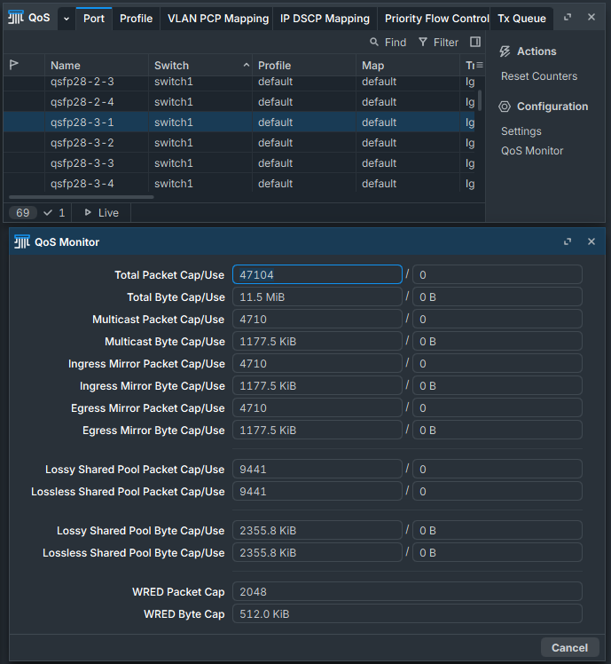
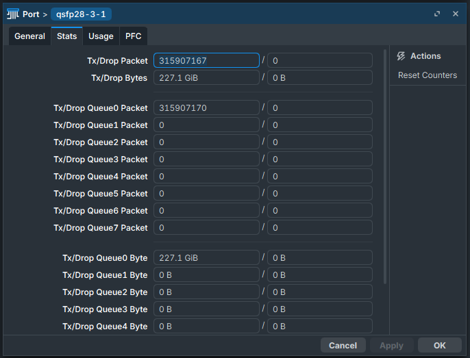
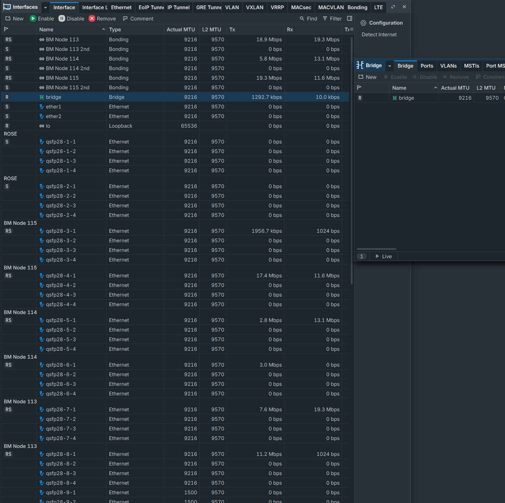

Ref: https://forums.developer.nvidia.com/t/any-proven-and-documented-out-of-box-to-fully-configured-instructions-for-mikrotik-crs812-ddq-for-4-node-setup/378431/7  
  
RoCE assumes a "lossless" network and you do not want dropped packets, to check:  
  
  
	
$${\color{deeppink}\textbf{\textsf{Note:}}}$$  To increase `bridge` MTU, all ports active on the bridge must have higher MTU set; bridge assumes lowest MTU of ports.  
  
  
$${\color{deeppink}\textbf{\textsf{Note:}}}$$ This script is idempotent and can be run multiple times

Ref: https://manual.mikrotik.com/docs/bridging-and-switching/quality-of-service#rdma-over-converged-ethernet-roce 
```text
# Ref: https://manual.mikrotik.com/docs/bridging-and-switching/quality-of-service#rdma-over-converged-ethernet-roce 
# To run from terminal: /system/script/run Enable-RoCE

:local portArray {"qsfp28-3-1"; "qsfp28-4-1"; "qsfp28-5-1"; "qsfp28-6-1"; "qsfp28-7-1"; "qsfp28-8-1"}
:local prettyPorts ""

:local pfcProfileName "pfc-tc3"
:local roceProfileName "non-default-roce"
:local cnpProfileName "non-default-cnp"


:if ([:typeof $portArray] != "nothing" and [:len $portArray] > 0) do={
    # Create RoCE and CNP Profiles
    /interface ethernet switch qos profile
    :if ([:len [find where name="$roceProfileName"]] > 0) do={
        :put "RoCE profile '$roceProfileName' already exists."
    } else={
        :put "RoCE profile '$roceProfileName' not found. Creating it now..."
        add name="$roceProfileName" dscp=26 traffic-class=3 automap=yes comment="RoCE v2 Traffic"
    }
    :if ([:len [find where name="$cnpProfileName"]] > 0) do={
        :put "CNP profile '$cnpProfileName' already exists."
    } else={
        :put "CNP profile '$cnpProfileName' not found. Creating it now..."
        add name="$cnpProfileName" dscp=48 traffic-class=6 automap=yes comment="RoCE v2 Congestion Notification Packets"
    }

    # Configure hardware queue and scheduler
    # Defaults:
    # set 1 schedule=low-priority-group weight=2
    # set 3 schedule=high-priority-group weight=3 and ecn=no
    # set 6 schedule=strict-priority

    /interface/ethernet/switch/qos/tx-manager/queue
    set 1 schedule=high-priority-group weight=1
    set 3 schedule=high-priority-group weight=1 use-shared-buffers=yes wred=no ecn=yes
    set 6 schedule=strict-priority

    # Create Lossless PFC Profile if it doesn't exist    
    /interface/ethernet/switch/qos/priority-flow-control
    :if ([:len [find where name="$pfcProfileName"]] > 0) do={
        :put "PFC profile '$pfcProfileName' already exists."
    } else={
        :put "PFC profile '$pfcProfileName' not found. Creating it now..."
        add name="$pfcProfileName" traffic-class=3 rx=yes tx=yes comment="RoCE v2 Lossless Queue"
    }

    # Iterate through ports and make changes  
    :foreach port in=$portArray do={
        :set prettyPorts ($prettyPorts . $port . ", ")

        /interface/ethernet/switch/qos/port
        set [find name=$port] egress-rate-queue3=100G pfc="$pfcProfileName" trust-l3=keep
    }

    # Remove the trailing comma and space from the very end for output
    :set prettyPorts [:pick $prettyPorts 0 ([:len $prettyPorts] - 2)]

    # Make sure QoS HW Offload is turned on and activate above settings
    /interface/ethernet/switch
    set switch1 qos-hw-offloading=yes

    # Enable the LLDP Data Center Bridging Capability Exchange Protocol (DCBX)
    /ip/neighbor/discovery-settings
    set lldp-dcbx=yes

    :put ("RoCEv2 network optimizations successfully enabled on: $prettyPorts")
} else={
    :put "Warning: No ports found!"
}
```