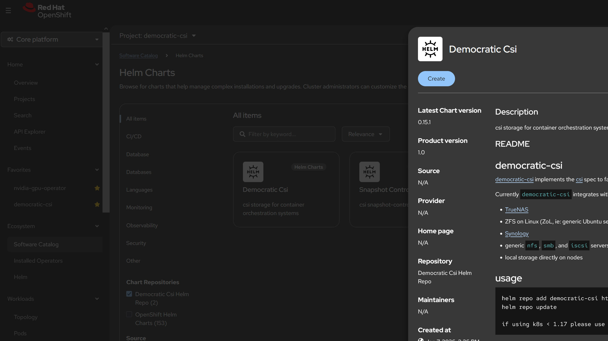
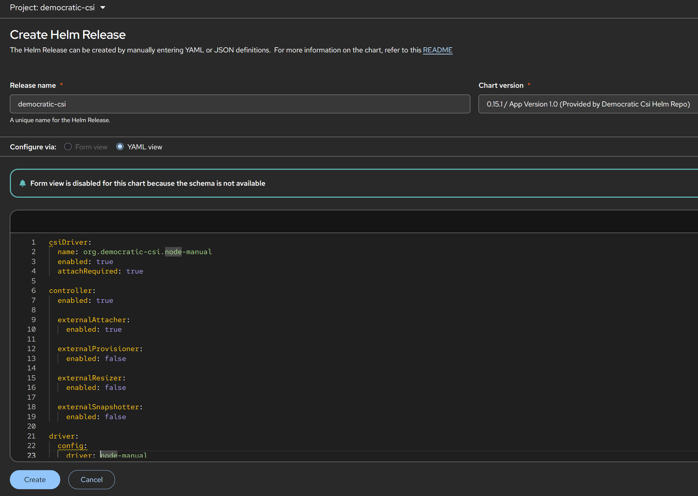

### How to set up democratic-csi to a Mikrotik NVMeoTCP target

#### Create the namespace:
```bash
oc create namespace democratic-csi --dry-run=client -o yaml | oc apply -f -

oc label namespace democratic-csi \
  pod-security.kubernetes.io/enforce=privileged \
  pod-security.kubernetes.io/audit=privileged \
  pod-security.kubernetes.io/warn=privileged \
  --overwrite
```
The chart has an OpenShift-specific setting that grants its node service account access to the `privileged` SCC.  
  
#### Add the Helm repo to the project:
[Source: `Sources/democratic-csi-helm-repo.yaml`](Sources/democratic-csi-helm-repo.yaml)
<!-- embed-code: ./Sources/democratic-csi-helm-repo.yaml -->
```yaml
apiVersion: helm.openshift.io/v1beta1
kind: ProjectHelmChartRepository
metadata:
  name: democratic-csi-helm-repo
  namespace: democratic-csi
spec:
  connectionConfig:
    url: 'https://democratic-csi.github.io/charts/'
```
  
#### Get the Helm Chart

  
#### OpenShift-specific values:
[Source: `Sources/democratic-csi-mikrotik.yaml`](Sources/democratic-csi-mikrotik.yaml)
<!-- embed-code: ./Sources/democratic-csi-mikrotik.yaml -->
```yaml
csiDriver:
  name: org.democratic-csi.node-manual
  enabled: true
  attachRequired: true

controller:
  enabled: true

  externalAttacher:
    enabled: true

  externalProvisioner:
    enabled: false

  externalResizer:
    enabled: false

  externalSnapshotter:
    enabled: false

driver:
  config:
    driver: node-manual

node:
  enabled: true

  # Required so NVMe/TCP uses the RHCOS host routing table.
  # Therefore traffic to 172.16.100.125 follows bond1.100.
  hostNetwork: true

  rbac:
    enabled: true
    openshift:
      privileged: true

  driver:
    # Upstream specifically notes null for OpenShift-like OSes.
    localtimeHostPath: null

    # We are not currently restricting the RDS target by host NQN,
    # therefore the host /etc/nvme directory does not need mounting.
    nvmeDirMountEnabled: false

    logLevel: info

storageClasses: []
volumeSnapshotClasses: []
```

#### Create Helm Release (With OpenShift-specific values):

  
#### Verify:
```bash
[dave@rhel9dummy2 ~]$ oc get csidriver org.democratic-csi.node-manual
NAME                             ATTACHREQUIRED   PODINFOONMOUNT   STORAGECAPACITY   TOKENREQUESTS   REQUIRESREPUBLISH   MODES        AGE
org.democratic-csi.node-manual   true             true             false             <unset>         false               Persistent   4m17s

[dave@rhel9dummy2 ~]$ oc -n democratic-csi get ds,deploy
NAME                                 DESIRED   CURRENT   READY   UP-TO-DATE   AVAILABLE   NODE SELECTOR            AGE
daemonset.apps/democratic-csi-node   3         3         3       3            3           kubernetes.io/os=linux   4m33s

NAME                                        READY   UP-TO-DATE   AVAILABLE   AGE
deployment.apps/democratic-csi-controller   1/1     1            1           4m33s
```
#### Verify the CSI node pod can discover the MikroTik target:
```bash
[dave@rhel9dummy2 ~]$ CSIPOD=$(oc -n democratic-csi get pods \
  -l 'app.kubernetes.io/instance=democratic-csi,app.kubernetes.io/csi-role=node' \
  --field-selector spec.nodeName=ocp113.localdomain \
  -o jsonpath='{.items[0].metadata.name}')

echo "${CSIPOD}"
democratic-csi-node-gdq6j
```
Then:  
```bash
oc -n democratic-csi exec \
  "${CSIPOD}" \
  -c csi-driver \
  -- nvme discover \
     -t tcp \
     -a 172.16.100.125 \
     -s 4420
```
Output:
```bash
Discovery Log Number of Records 1, Generation counter 2
=====Discovery Log Entry 0======
trtype:  tcp
adrfam:  ipv4
subtype: nvme subsystem
treq:    not specified, sq flow control disable supported
portid:  4420
trsvcid: 4420
subnqn:  nqn.2026-09.com.mikrotik:rds2216.vm-storage-001
traddr:  172.16.100.125
eflags:  none
sectype: none
```
#### Verify the namespace ID before creating the PV:  
Manually attach it once from ocp113:  
```bash
[dave@rhel9dummy2 ~]$ oc debug node/ocp113.localdomain --quiet -- chroot /host bash -c '
  modprobe nvme_tcp

  nvme connect \
    -t tcp \
    -a 172.16.100.125 \
    -s 4420 \
    -n nqn.2026-09.com.mikrotik:rds2216.vm-storage-001

  echo
  nvme list

  echo
  nvme list-subsys
'
connecting to device: nvme1
```
```bash
Node                  Generic               SN                   Model                                    Namespace  Usage                      Format           FW Rev
--------------------- --------------------- -------------------- ---------------------------------------- ---------- -------------------------- ---------------- --------
/dev/nvme0n1          /dev/ng0n1            PHMB751300WU480DGN   INTEL SSDPED1D480GA                      0x1        480.10  GB / 480.10  GB    512   B +  0 B   E2010650
/dev/nvme1n1          /dev/ng1n1            f132ac7914cdb3dc     Linux                                    0x1          1.10  TB /   1.10  TB    512   B +  0 B   5.6.3

nvme-subsys0 - NQN=nqn.2014.08.org.nvmexpress:80868086PHMB751300WU480DGN  INTEL SSDPED1D480GA
               hostnqn=nqn.2014-08.org.nvmexpress:uuid:8da769da-ae4e-43b5-a9eb-ea2de1d752d6
               iopolicy=numa
\
 +- nvme0 pcie 0000:41:00.0 live

nvme-subsys1 - NQN=nqn.2026-09.com.mikrotik:rds2216.vm-storage-001
               hostnqn=nqn.2014-08.org.nvmexpress:uuid:8da769da-ae4e-43b5-a9eb-ea2de1d752d6
               iopolicy=numa
\
 +- nvme1 tcp traddr=172.16.100.125,trsvcid=4420,src_addr=172.16.100.113 live
```
Now identify its controller and NSID:
```bash
[dave@rhel9dummy2 ~]$ oc debug node/ocp113.localdomain --quiet -- chroot /host bash -c '
echo "=== NVMe devices ==="
nvme list

echo
echo "=== Verbose mapping ==="
nvme list -v

echo
echo "=== Namespaces reported by controller nvme1 ==="
nvme list-ns /dev/nvme1 -a

echo
echo "=== Namespace IDs from sysfs ==="
for NS in /sys/block/nvme*n*; do
    [ -e "${NS}/nsid" ] || continue
    echo "$(basename "${NS}") NSID=$(cat "${NS}/nsid")"
done
'
=== NVMe devices ===
Node                  Generic               SN                   Model                                    Namespace  Usage                      Format           FW Rev
--------------------- --------------------- -------------------- ---------------------------------------- ---------- -------------------------- ---------------- --------
/dev/nvme0n1          /dev/ng0n1            PHMB751300WU480DGN   INTEL SSDPED1D480GA                      0x1        480.10  GB / 480.10  GB    512   B +  0 B   E2010650
/dev/nvme1n1          /dev/ng1n1            f132ac7914cdb3dc     Linux                                    0x1          1.10  TB /   1.10  TB    512   B +  0 B   5.6.3

=== Verbose mapping ===
Subsystem        Subsystem-NQN                                                                                    Controllers
---------------- ------------------------------------------------------------------------------------------------ ----------------
nvme-subsys0     nqn.2014.08.org.nvmexpress:80868086PHMB751300WU480DGN  INTEL SSDPED1D480GA                       nvme0
nvme-subsys1     nqn.2026-09.com.mikrotik:rds2216.vm-storage-001                                                  nvme1

Device           Cntlid SN                   MN                                       FR       TxPort Address        Slot   Subsystem    Namespaces
---------------- ------ -------------------- ---------------------------------------- -------- ------ -------------- ------ ------------ ----------------
nvme0            0      PHMB751300WU480DGN   INTEL SSDPED1D480GA                      E2010650 pcie   0000:41:00.0          nvme-subsys0 nvme0n1
nvme1            1      f132ac7914cdb3dc     Linux                                    5.6.3    tcp    traddr=172.16.100.125,trsvcid=4420,src_addr=172.16.100.113        nvme-subsys1 nvme1n1

Device            Generic           NSID       Usage                                             Format           Controllers
----------------- ----------------- ---------- ------------------------------------------------- ---------------- ----------------
/dev/nvme0n1      /dev/ng0n1        0x1        480.10 GB / 480.10 GB ( 447.13 GiB /  447.13 GiB) 512   B +  0 B   nvme0
/dev/nvme1n1      /dev/ng1n1        0x1          1.10 TB /   1.10 TB (   1.00 TiB /    1.00 TiB) 512   B +  0 B   nvme1

=== Namespaces reported by controller nvme1 ===
NVMe status: Invalid Field in Command: A reserved coded value or an unsupported value in a defined field(0x6002)

=== Namespace IDs from sysfs ===
nvme0n1 NSID=1
nvme1c1n1 NSID=1
nvme1n1 NSID=1
```
I expect something like (NSID = NVMe NameSpace ID):
```bash
=== Namespace IDs from sysfs ===
nvme1n1 NSID=1
```
Then disconnect the manual test:
```bash
oc debug node/ocp113.localdomain --quiet -- chroot /host \
  nvme disconnect \
  -n nqn.2026-09.com.mikrotik:rds2216.vm-storage-001
```
```bash  
NQN:nqn.2026-09.com.mikrotik:rds2216.vm-storage-001 disconnected 1 controller(s)
```
From this point forward, let CSI own the connection.  
  
#### Create the raw-block PV and PVC:  
First create a test namespace:  
```bash
oc create namespace nvme-test --dry-run=client -o yaml | oc apply -f -
```
Then create the PV/PVC:  
[Source: `Sources/mikrotik-vm-storage-001.yaml`](Sources/mikrotik-vm-storage-001.yaml)
<!-- embed-code: ./Sources/mikrotik-vm-storage-001.yaml -->
```yaml
apiVersion: v1
kind: PersistentVolume
metadata:
  name: mikrotik-vm-storage-001
spec:
  capacity:
    storage: 1Ti

  accessModes:
    - ReadWriteOnce

  persistentVolumeReclaimPolicy: Retain

  storageClassName: ""

  volumeMode: Block

  csi:
    driver: org.democratic-csi.node-manual
    readOnly: false

    volumeHandle: mikrotik-rds2216-vm-storage-001

    volumeAttributes:
      transport: "tcp://172.16.100.125:4420"
      nqn: "nqn.2026-09.com.mikrotik:rds2216.vm-storage-001"
      nsid: "1"
      node_attach_driver: "nvmeof"
      provisioner_driver: "node-manual"

---
apiVersion: v1
kind: PersistentVolumeClaim
metadata:
  name: mikrotik-vm-storage-001
  namespace: nvme-test
spec:
  accessModes:
    - ReadWriteOnce

  volumeMode: Block

  storageClassName: ""

  volumeName: mikrotik-vm-storage-001

  resources:
    requests:
      storage: 1Ti
```
Then check binding:
```bash
[dave@rhel9dummy2 ~]$ echo "=== PV ==="
oc get pv mikrotik-vm-storage-001

echo
echo "=== PVC ==="
oc -n nvme-test get pvc mikrotik-vm-storage-001
=== PV ===
NAME                      CAPACITY   ACCESS MODES   RECLAIM POLICY   STATUS   CLAIM                               STORAGECLASS   VOLUMEATTRIBUTESCLASS   REASON   AGE
mikrotik-vm-storage-001   1Ti        RWO            Retain           Bound    nvme-test/mikrotik-vm-storage-001                  <unset>                          26s

=== PVC ===
NAME                      STATUS   VOLUME                    CAPACITY   ACCESS MODES   STORAGECLASS   VOLUMEATTRIBUTESCLASS   AGE
mikrotik-vm-storage-001   Bound    mikrotik-vm-storage-001   1Ti        RWO                           <unset>                 26s
```
We want both to show:
```bash
STATUS   Bound
```
So after the PV and PVC show `Bound`, we'll create the first raw-block test pod. That's the test that proves democratic-csi itself, rather than our manual `nvme connect`, can establish the NVMe/TCP session and expose the MikroTik device.  
  
Before creating the workload, verify the CSI deployment itself:
```bash
[dave@rhel9dummy2 ~]$ echo "=== CSI Driver ==="
oc get csidriver org.democratic-csi.node-manual

echo
echo "=== democratic-csi pods ==="
oc -n democratic-csi get pods -o wide

echo
echo "=== democratic-csi daemonset ==="
oc -n democratic-csi get ds

=== CSI Driver ===
NAME                             ATTACHREQUIRED   PODINFOONMOUNT   STORAGECAPACITY   TOKENREQUESTS   REQUIRESREPUBLISH   MODES        AGE
org.democratic-csi.node-manual   true             true             false             <unset>         false               Persistent   41m

=== democratic-csi pods ===
NAME                                         READY   STATUS    RESTARTS   AGE   IP             NODE                 NOMINATED NODE   READINESS GATES
democratic-csi-controller-678f86d9fc-89rgc   3/3     Running   0          41m   10.130.0.121   ocp114.localdomain   <none>           <none>
democratic-csi-node-gdq6j                    4/4     Running   0          41m   172.16.1.113   ocp113.localdomain   <none>           <none>
democratic-csi-node-ms695                    4/4     Running   0          41m   172.16.1.115   ocp115.localdomain   <none>           <none>
democratic-csi-node-wqnss                    4/4     Running   0          41m   172.16.1.114   ocp114.localdomain   <none>           <none>

=== democratic-csi daemonset ===
NAME                  DESIRED   CURRENT   READY   UP-TO-DATE   AVAILABLE   NODE SELECTOR            AGE
democratic-csi-node   3         3         3       3            3           kubernetes.io/os=linux   41m
```
#### Create a test pod:
[Source: `Sources/nvme-block-test.yaml`](Sources/nvme-block-test.yaml)
<!-- embed-code: ./Sources/nvme-block-test.yaml -->
```yaml
apiVersion: v1
kind: Pod
metadata:
  name: nvme-block-test
  namespace: nvme-test
spec:
  serviceAccountName: nvme-block-test
  containers:
    - name: test
      image: registry.access.redhat.com/ubi9/ubi:latest

      securityContext:
        privileged: true

      command:
        - /bin/bash
        - -c
        - |
          echo "=== MikroTik NVMe raw block device ==="
          ls -l /dev/mikrotik-nvme

          echo
          echo "=== Device size ==="
          blockdev --getsize64 /dev/mikrotik-nvme

          echo
          echo "=== First 4 KiB read test ==="
          dd if=/dev/mikrotik-nvme of=/dev/null bs=4096 count=1 status=progress

          echo
          echo "NVMe block device successfully attached."
          sleep infinity

      volumeDevices:
        - name: mikrotik-storage
          devicePath: /dev/mikrotik-nvme

  volumes:
    - name: mikrotik-storage
      persistentVolumeClaim:
        claimName: mikrotik-vm-storage-001
```
Watch it closely:
```bash
oc -n nvme-test get pod nvme-block-test -o wide -w
```
What we want is:
```bash
STATUS    Running
```
At that point, CSI has actually performed the attachment.  
  
#### Check the pod output:
```bash
oc -n nvme-test logs nvme-block-test
```
You should see something along these lines:
```bash
=== MikroTik NVMe raw block device ===
brw------- ... /dev/mikrotik-nvme

=== Device size ===
1099511627776

=== First 4 KiB read test ===
4096 bytes copied ...

NVMe block device successfully attached.
```
We're deliberately doing read-only testing here. Don't `mkfs`, `dd` into the device, or otherwise write to it yet.
  
#### Verify which OpenShift node attached it:
```bash
NODE=$(oc -n nvme-test get pod nvme-block-test \
  -o jsonpath='{.spec.nodeName}')

echo "${NODE}"
```
Then verify the route:
```bash
oc debug node/${NODE} --quiet -- chroot /host \
  ip route get 172.16.100.125
```
You should get something like:
```bash
172.16.100.125 dev bond1.100 src 172.16.100.113
```
With the appropriate .113, .114, or .115 source depending on where the pod landed.  
  
#### Verify CSI actually established the NVMe/TCP session:
```bash
oc debug node/${NODE} --quiet -- chroot /host \
  nvme list-subsys
```
We want to see:
```bash
NQN=nqn.2026-09.com.mikrotik:rds2216.vm-storage-001
```
And underneath it:
```bash
tcp traddr=172.16.100.125,trsvcid=4420,src_addr=172.16.100.xxx live
```
Also:
```bash
oc debug node/${NODE} --quiet -- chroot /host \
  nvme list
```
You should now see your existing local Intel NVMe plus another device similar to:
```bash
/dev/nvme1n1   Linux   0x1   1.10 TB / 1.10 TB
```
The actual nvmeXnY numbering may vary by node, which is fine. CSI tracks the NQN/NSID rather than depending on a fixed /dev/nvme1n1 name.
  
#### Create a StorageClass for these MikroTik NVMe volumes:
[Source: `Sources/mikrotik-nvme-storageclass.yaml`](Sources/mikrotik-nvme-storageclass.yaml)
<!-- embed-code: ./Sources/mikrotik-nvme-storageclass.yaml -->
```yaml
apiVersion: storage.k8s.io/v1
kind: StorageClass
metadata:
  name: mikrotik-nvme
provisioner: org.democratic-csi.node-manual
reclaimPolicy: Delete
volumeBindingMode: WaitForFirstConsumer
allowVolumeExpansion: false
```
#### Create a PV:
[Source: `Sources/mikrotik-vm-storage-001-pv.yaml`](Sources/mikrotik-vm-storage-001-pv.yaml)
<!-- embed-code: ./Sources/mikrotik-vm-storage-001-pv.yaml -->
```yaml
apiVersion: v1
kind: PersistentVolume
metadata:
  name: mikrotik-vm-storage-001
spec:
  capacity:
    storage: 1Ti

  accessModes:
    - ReadWriteOnce

  persistentVolumeReclaimPolicy: Retain

  storageClassName: mikrotik-nvme

  volumeMode: Block

  csi:
    driver: org.democratic-csi.node-manual
    readOnly: false
    volumeHandle: mikrotik-rds2216-vm-storage-001

    volumeAttributes:
      transport: "tcp://172.16.100.125:4420"
      nqn: "nqn.2026-09.com.mikrotik:rds2216.vm-storage-001"
      nsid: "1"
      node_attach_driver: "nvmeof"
      provisioner_driver: "node-manual"
```
#### Create a PVC:
[Source: `Sources/mikrotik-vm-storage-001-pvc.yaml`](Sources/mikrotik-vm-storage-001-pvc.yaml)
<!-- embed-code: ./Sources/mikrotik-vm-storage-001-pvc.yaml -->
```yaml
apiVersion: v1
kind: PersistentVolumeClaim
metadata:
  name: mikrotik-vm-storage-001
  namespace: nvme-test
spec:
  accessModes:
    - ReadWriteOnce

  volumeMode: Block
  storageClassName: mikrotik-nvme

  resources:
    requests:
      storage: 1Ti
```
$${\color{yellow}\textbf{\textsf{CRITICAL:}}}$$ One important limitation:  
- This StorageClass will not automatically create a new file-backed target on the RDS. `node-manual` is specifically for connecting to volumes you created manually. 
- `democratic-csi` describes `node-manual` as the driver for manually created NFS, SMB, iSCSI, NVMe-oF, and related volumes.
  
